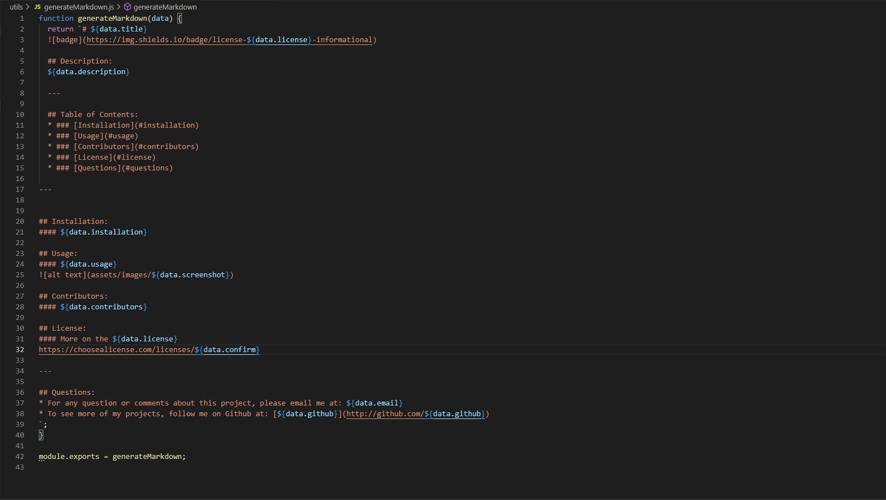

# Readme Generator
    
  
    ## Description:
    Generate a README.md file about your project by answering commandline prompts.
  
    ---
  
    ## Table of Contents:
    * ### [Installation](#installation)
    * ### [Usage](#usage)
    * ### [Contributors](#contributors)
    * ### [License](#license)
    * ### [Questions](#questions)
  
  ---
  
    
  ## Installation:
  #### Clone the Repository -> In the root folder, enter 'node index.js' in the command line and answer prompts -> README.md is generated.
  
  ## Usage:
  #### to generate a README.md file.
  
  
  ## Contributors:
  #### Yago Lira
  
  ## License:
  #### More on the MIT license:
  [MIT](https://opensource.org/licenses/MIT)
  
  ---
  
  ## Questions:
  * For any question or comments about this project, please email me at: yagolira02@hotmail.com
  * To see more of my projects, follow me on Github at: [yago-pixel](http://github.com/yago-pixel)
  
=======
## Installation:
#### Clone the Repository -> In the root folder, enter 'node index.js' in the command line and answer prompts -> README.md is generated.

## Usage:
#### To generate a README.md file.

## Contributors:
#### Yago Lira

## License:
#### More on the MIT license:

---

## Questions:
* For any question or comments about this project, please email me at: yagolira02@hotmail.com
* To see more of my projects, follow me on Github at: [yago-pixel] http://github.com/yago-pixel
>>>>>>> e5afbcc212112a150afe24facf41f2e04ac3ad46
